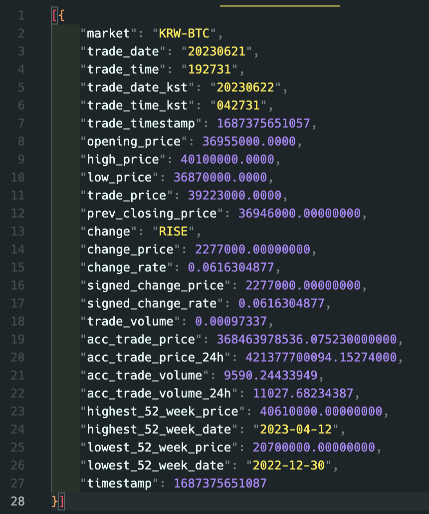
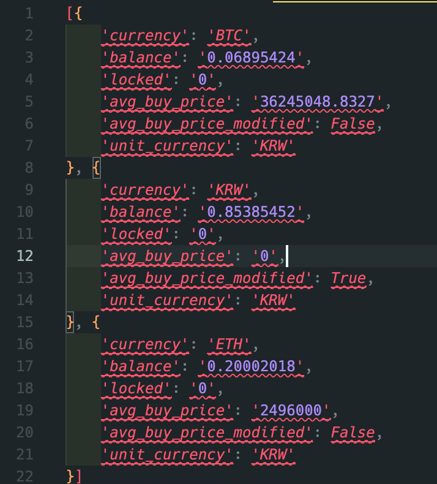

코인봇을 만들어 일확천금을 벌어보자.  

시스템 환경 : Mac OS(Silicon M1)


##  1. 업비트 OPEN API KEY 발급받기

### 업비트 사이트 방문해서 OPEN API 신청

[https://www.upbit.com/service_center/open_api_guide](https://www.upbit.com/service_center/open_api_guide)(업비트 > 고객센터 > Open API 안내 > Open API 사용하기)

### IP주소 조회

```shell
curl ifconfig.me
```
* 네이버 "IP주소 확인" 검색으로도 조회 가능


## 2. API 레퍼런스 확인

[https://docs.upbit.com/reference](https://docs.upbit.com/reference)(고객센터 > Open API 안내 > 업비트 개발자 센터 > API Reference)

## 3. 파이썬 연동하기

### 현재가 조회

먼저 API KEY를 필요로 하지 않는 "현재가 조회"부터 진행해보자.

```python
import requests

# 현재가 정보조회 

def getCurrentAmt(coinCode):

    url = "https://api.upbit.com/v1/ticker?markets=" + coinCode
    headers = {"accept": "application/json"}
    response = requests.get(url, headers=headers)

    print(response.text)

getCurrentAmt('KRW-BTC') #  비트코인 조회
```




### 계좌 조회

계좌 조회간 API\_ACCESS\_KEY, API\_SECRET\_KEY 가 필요하다.
아래에 키값을 입력하고 조회해보자

```python
import jwt
import hashlib
import os
import requests
import uuid
from urllib.parse import urlencode, unquote


os.environ['UPBIT_OPEN_API_ACCESS_KEY'] = "API_ACCESS_KEY 입력"
os.environ['UPBIT_OPEN_API_SECRET_KEY'] = "API_SECRET_KEY 입력"
os.environ['UPBIT_OPEN_API_SERVER_URL'] = "https://api.upbit.com"
access_key = os.environ['UPBIT_OPEN_API_ACCESS_KEY']
secret_key = os.environ['UPBIT_OPEN_API_SECRET_KEY']
server_url = os.environ['UPBIT_OPEN_API_SERVER_URL']


# 전계좌 조회
def getMyBalance() :

    params = {
    }

    payload = {
        'access_key': access_key,
        'nonce': str(uuid.uuid4()),
    }

    jwt_token = jwt.encode(payload, secret_key)
    authorization = 'Bearer {}'.format(jwt_token)
    headers = {
        'Authorization': authorization,
    }

    res = requests.get(server_url + '/v1/accounts',params=params, headers=headers)

    print(res.json())

getMyBalance() #  계좌조회
```




