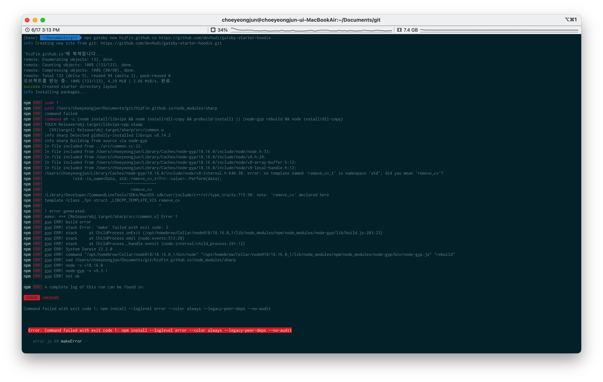

##  오류 내용



**오류 내용 일부**  
```shell
npm ERR! /Users/choeyeongjun/Library/Caches/node-gyp/18.16.0/include/node/v8-internal.h:646:38: error: no template named 'remove_cv_t' in namespace 'std'; did you mean 'remove_cv'?
npm ERR!             !std::is_same<Data, std::remove_cv_t<T>>::value>::Perform(data);
npm ERR!                                 ~~~~~^~~~~~~~~~~
npm ERR!                                      remove_cv
```
* v8-internal.h 파일에서 remove_cv_t를 정상적으로 인식하지 못하는 상태


## 언제

gatsby 설치(hoodie 템플릿) 간 발생

```shell
npx gatsby new hizFin.github.io https://github.com/devHudi/gatsby-starter-hoodie
```

## 원인

아마도 템플릿과 설치한 node(v18)에 충돌이 일어난 것으로 보인다.  
아무튼 에러 내용으로 보아 특정 파일의 문구만 변경하면 될 듯 하다.

## 해결

에러 내용에 써 있듯이 소스 변경을 해보자.

**1. 소스 변경**

파일 위치 : /Users/choeyeongjun/Library/Caches/node-gyp/18.16.0/include/node/v8-internal.h  
소스 변경 : remove_cv_t -> remove_cv

**2. gatsby 재설치 (성공)**


## 참고
stackoverflow : https://stackoverflow.com/questions/67241196/error-no-template-named-remove-cv-t-in-namespace-std-did-you-mean-remove

